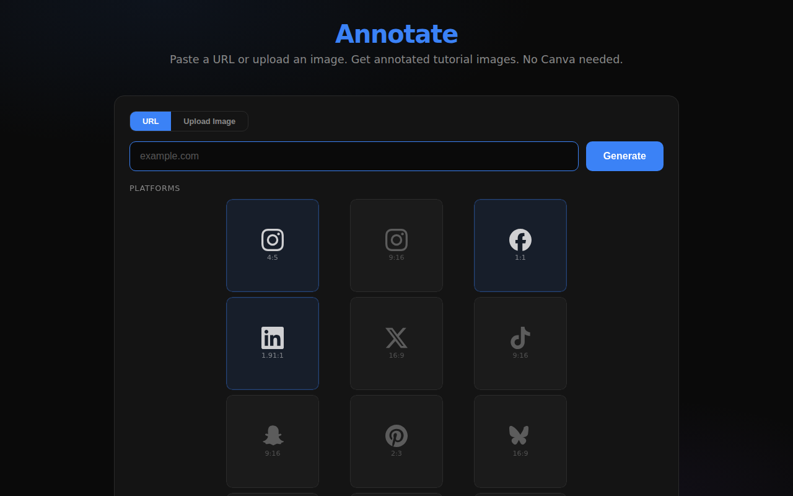
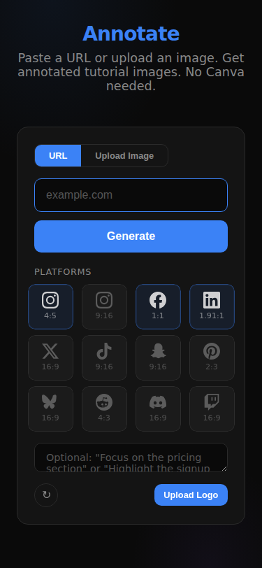

# Annotate

### Paste a URL. Get annotated tutorial images. No Canva needed.

> **"What if turning any webpage into annotated social media images took 10 seconds instead of 30 minutes in Canva?"**

Built for the **Scrapes.ai x Hostinger Hackathon 2026** · Live at **[annotate.felaniam.cloud](https://annotate.felaniam.cloud)**

---

## The Problem

Creators, educators, and marketers constantly find web content worth sharing — a product launch, a tutorial walkthrough, an interesting landing page. But turning that into visual social content means:

- Screenshotting the page and cropping manually
- Opening Canva/Figma to place highlights and callouts
- Drawing arrows, writing labels, picking colors by hand
- Exporting and resizing for every platform
- Repeating the whole process for each social network

**A 2-minute discovery becomes a 30-minute design task.** Most people just share a link and move on.

---

## The Solution

**Annotate** eliminates the design step entirely. Give it a URL, pick your platforms, and it delivers annotated tutorial images — with intelligent highlights, arrows, callouts, and a cohesive color scheme — rendered and ready to post.

No templates. No drag-and-drop. No design decisions. Claude Vision *sees* the page, *understands* what matters, and *annotates* it for you.

```
URL  →  Screenshot  →  AI Analysis  →  SVG Annotations  →  Rendered PNG  →  Download & Post
```

---

## Features

- **8 Social Platforms** — Instagram Feed (4:5), Instagram Stories (9:16), Facebook (1:1), LinkedIn (1.91:1), X/Twitter (16:9), TikTok (9:16), Snapchat (9:16), Pinterest (2:3)
- **One-Pass Intelligence** — Claude Vision analyzes once, renders to any ratio. 1 format or 8 = same ~$0.03 API cost
- **Ratio Deduplication** — Platforms sharing a ratio (IG Stories / TikTok / Snapchat) render once, not three times
- **User-Guided Focus** — Tell it what to highlight: *"Focus on the pricing table"* or *"Annotate the signup flow"*
- **Percentage-Based Coordinates** — Annotations scale naturally to any aspect ratio without re-running the AI
- **Image Upload Support** — Don't have a URL? Drop in a screenshot directly
- **Batch Download** — One click to grab every generated image
- **Dark Minimal UI** — Clean interface, no clutter

---

## Demo

| Step | What Happens |
|------|-------------|
| **1. Paste** | Drop any URL into the input field |
| **2. Select** | Check the platforms you want (Instagram, LinkedIn, X, etc.) |
| **3. Guide** *(optional)* | Add a prompt to steer what Claude focuses on |
| **4. Generate** | Hit go — results appear in ~10 seconds |
| **5. Download** | Grab individual images or batch download all |

**Try it live:** [annotate.felaniam.cloud](https://annotate.felaniam.cloud)

<p align="center">
  
</p>

<details>
<summary>Mobile view</summary>
<p align="center">
  
</p>
</details>

---

## How It Works

Annotate separates **annotation** (the expensive, creative AI step) from **rendering** (the mechanical compositing step):

```
┌──────────┐     ┌────────────────┐     ┌──────────────────┐     ┌────────────────┐
│  Browser  │────▶│  Express Server │────▶│  Claude Vision    │────▶│  n8n Pipeline   │
│           │     │  (proxy + API)  │     │  (analyze once)   │     │  (render N fmt) │
└──────────┘     └────────────────┘     └──────────────────┘     └────────────────┘
                        │                        │                        │
                        ▼                        ▼                        ▼
                  ScreenshotOne           Structured JSON           Browserless
                 (HMAC-signed             annotation plan          (HTML → PNG)
                  page capture)        + metadata extraction
```

Claude returns all annotations in **percentage-based coordinates**, so the same plan scales naturally to 4:5, 9:16, 1:1, 16:9 — or any future ratio — without re-running the AI. Selecting 8 platforms generates **one** annotation plan and renders it 8 ways. Same highlights, same arrows, same callouts, just resized. Consistent visual identity across platforms without paying 8x.

---

## Tech Stack

| Technology | Role | Why This |
|-----------|------|----------|
| **Node.js + Express** | Server & API proxy | Minimal, fast, handles the single `/api/annotate` endpoint |
| **Claude Sonnet** | Vision analysis + annotation planning | Best-in-class vision understanding — sees UI elements, not just pixels |
| **ScreenshotOne** | Page capture | HMAC-signed requests, viewport screenshots |
| **Browserless** | HTML → PNG rendering | Self-hosted headless Chrome — renders SVG overlays onto screenshots at exact pixel dimensions |
| **n8n** | Workflow orchestration | Visual pipeline that connects screenshot → analysis → rendering (9 nodes) |
| **Coolify** | Deployment platform | One-click Docker deploys on Hostinger VPS — the entire stack self-hosted |

**Dependencies:** `express`

---

## Getting Started

### Prerequisites

- Node.js 18+
- Running [n8n](https://n8n.io) instance with the Annotate workflow
- [Browserless](https://browserless.io) instance (self-hosted or cloud)
- [ScreenshotOne](https://screenshotone.com) API credentials
- [Anthropic](https://anthropic.com) API key (configured in n8n)

### Local Setup

```bash
# Clone
git clone https://github.com/txmyer-dev/annotate.git
cd annotate

# Install
npm install

# Configure
export N8N_WEBHOOK=https://your-n8n-instance/webhook/annotate

# Run
npm start
```

App runs on `http://localhost:3100`

### Docker

```bash
docker build -t annotate .
docker run -p 3100:3100 \
  -e N8N_WEBHOOK=https://your-n8n/webhook/annotate \
  annotate
```

### Environment Variables

| Variable | Default | Description |
|----------|---------|-------------|
| `PORT` | `3100` | Server port |
| `N8N_WEBHOOK` | `https://n8n.felaniam.cloud/webhook/annotate` | n8n webhook URL |

---

## Known Limitations

- **Authenticated pages not supported.** Pages behind login walls can't be captured. An auth feature was prototyped (Browserless Puppeteer login automation) but shelved due to environment-specific fragility. The core approach is sound — see [auth notes](#authenticated-page-support-shelved) below.
- **Long pages may produce large screenshots.** Content-heavy pages can generate oversized images. Landing pages and short-form content work best.

---

## Architecture

```
annotate/
├── server.js           # Express server — proxies requests to n8n webhook
├── public/
│   └── index.html      # Single-page frontend (dark minimal UI)
├── Dockerfile          # Alpine Node container
├── docker-compose.yaml # Full stack compose with Traefik labels
└── package.json
```

**Cost per generation:** ~$0.03 (one Claude Sonnet vision call) + negligible compute for rendering. Generating 8 platform formats from one URL costs the same as generating 1.

---

## Authenticated Page Support (Shelved)

An authenticated page capture feature was prototyped and reverted. The approach — Browserless Puppeteer login automation with credentials isolated from the LLM — worked end-to-end but hit too many environment-specific issues (Browserless v2 sandbox limitations, n8n expression engine quirks, template literal escaping in Code nodes) to stabilize within the hackathon timeline.

The core architecture is sound: credentials flow through Express → n8n → Browserless only, never reaching Claude Vision. A future implementation should isolate auth capture as a separate n8n workflow to avoid destabilizing the main pipeline.

---

## License

MIT

---

<p align="center">
  Built with frustration toward Canva and respect for Claude's vision capabilities.<br/>
  <strong>Scrapes.ai x Hostinger Hackathon 2026</strong>
</p>
